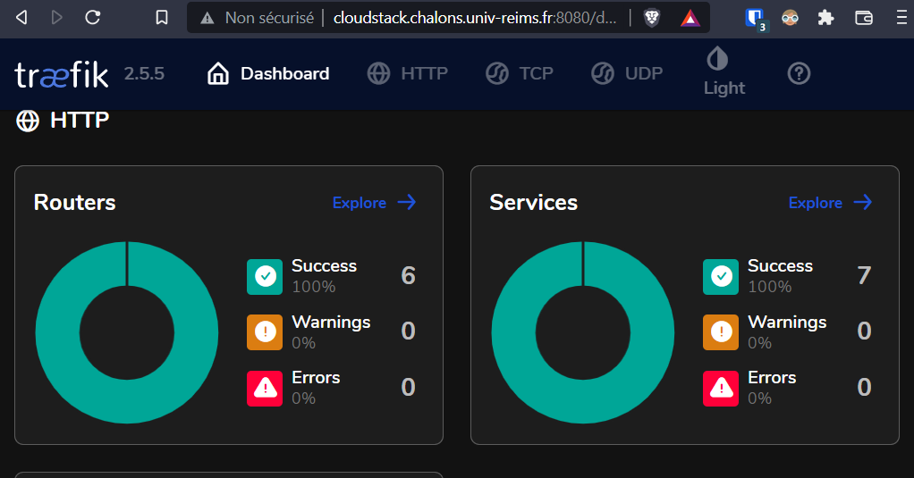
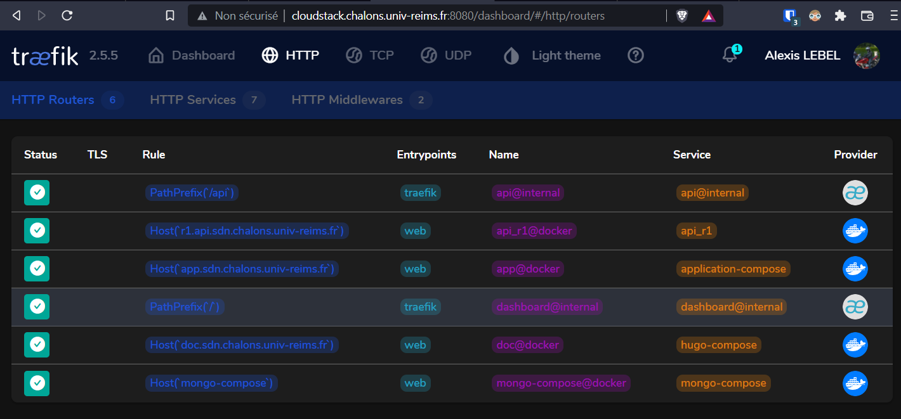

We have seen in previous chapters, the configuration of NGINX reverse-proxy. However, today, with Docker, NGINX is a bit obsolete, and there are more dynamic solutions like Traefik, which we will talk about in this article.

## The Traefik reverse proxy

Traefik is an open-source __reverse-proxy__ (also called _edge router_). \
A reverse proxy is a program that manages access to servers in a network behind it, adding security, logging, and sometimes encryption.

Traefik's special feature is its __service discovery__ function, which means that it works with Docker to create its configuration for the containers that are running. \
To do this, it needs to be given the Docker socket path, which we'll see in the next part, the <ins>configuration</ins>

## Configuration

The configuration of the reverse-proxy __Traefik__ is very simple. First of all, you need to __instantiate__ a Traefik container in the __docker-compose__ file:

```yaml
  reverse-proxy:
    # The official v2.0 Traefik docker image
    image: traefik:latest
    # Enables the web UI and tells Traefik to listen to docker
    command:
      --api.insecure=true
      --providers.docker
      --entrypoints.web.address=:80
    ports:
      # The HTTP port
      - "80:80"
      # The Web UI (enabled by --api.insecure=true)
      - "8080:8080"
    volumes:
      # So that Traefik can listen to the Docker events
      - /var/run/docker.sock:/var/run/docker.sock
      - /home/user/compose/traefik/traefik.toml:/etc/traefik/traefik.toml
      - /home/user/compose/traefik/acme.json:/acme.json
      - /home/user/compose/traefik/access.log:/var/log/access.log
    networks:
        backend:
```

Next, we edit the configuration file :

```toml
[api]
  dashboard = true # Activate the control panel..
  insecure = true #.. in http

[entryPoints]
  [entryPoints.web]
    address = ":80" # Set port 80 as entry

[providers]
  [providers.docker]
    watch = true
    exposedByDefault = false
    network = "backend" # Enable docker services discovery, on the "backend" network

[accessLog]
  filePath = "/var/log/access.log" # Log file

[pilot]
    token = "un-token" # Token for the "pilot" web service
```

We can then activate the service on the different containers:

```yaml
  hugo:
    image: nginx:latest
    restart: always
    volumes:
      - /home/user/compose/hugo/sdn_notice/public/:/usr/share/nginx/html/
    labels:
        - "traefik.enable=true" # Enable reverse-proxy for this container
        - traefik.http.routers.doc.rule=Host(`doc.sdn.chalons.univ-reims.fr`)" # Allows to define the access URL
    networks:
        backend:
    [...]
  api_r1:
    [...]
    labels:
      - "traefik.enable=true"
      - "traefik.http.services.api_r1.loadbalancer.server.port=8000" # Allow to specify the target port
      - "traefik.http.routers.api_r1.rule=Host(`r1.api.sdn.chalons.univ-reims.fr`)"
```

## The web interface

Once the configuration is done, we can access the web interface, which runs on port 8080:





This interface is only informative, no configuration can be done from it.